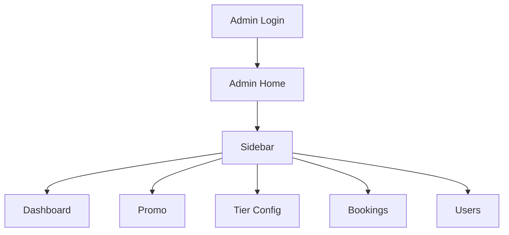

# Screen Diagrams - Smart Automated Car Wash

## 1. User Flow Overview

```mermaid
flowchart TD
    A[Landing / Home Page] --> B{Logged in?}
    B -- No --> C[Login / Sign Up Modal]
    B -- Yes --> D[Header: Home | Bookings | Promo]
    C --> E[User Home Page]
    D --> E
    D --> F[Bookings Modal]
    F --> G[Bookings Page]
    D --> H[Promo Page]
    G --> I[Active Bookings + Booking History + Point History]
    H --> J[Active Promo + Redeemable Promo by Tier]
```

## 2. Landing / Home Page

```text
+-----------------------------------------------------------+
| Keep browsing as Guest | Login / Sign Up                  |
+-----------------------------------------------------------+
| Hero / Welcome Banner                                     |
| - Book a wash                                             |
| - View loyalty perks                                      |
| - See active promotions                                   |
+-----------------------------------------------------------+
| Featured Services / Quick Actions                         |
| - Book now                                               |
| - View rewards                                           |
| - Check tier status                                      |
+-----------------------------------------------------------+
```

### Notes
- Guest users can browse the homepage without logging in.
- Clicking Login / Sign Up opens the authentication modal.
- After login, the header changes to show Home, Bookings, and Promo.

## 3. Login / Sign Up Modal

```text
+-------------------------------+
| Login / Sign Up               |
| ----------------------------- |
| Email / Phone                 |
| Password                      |
| [Login] [Sign Up]            |
| Forgot password?              |
+-------------------------------+
```

## 4. Logged-in User Header and Navigation

```text
+-----------------------------------------------------------+
| Home | Bookings | Promo | User Profile                    |
+-----------------------------------------------------------+
```

### Navigation behavior
- Click Home -> go to homepage.
- Click Bookings -> open Active Bookings modal.
- Click Promo -> go to Promo page.

## 5. Active Bookings Modal

```text
+---------------------------------------------+
| Active Bookings                             |
| ------------------------------------------- |
| - Upcoming booking 1                        |
| - Upcoming booking 2                        |
| - Upcoming booking 3                        |
| ------------------------------------------- |
| [See more]                                  |
+---------------------------------------------+
```

### Notes
- This is a lightweight summary modal.
- Clicking See more opens the full Bookings page.

## 6. Bookings Page

```text
+-----------------------------------------------------------+
| Bookings Page                                             |
|-----------------------------------------------------------|
| Active Bookings                                           |
| - Booking A | Confirmed | 2026-08-12                      |
| - Booking B | Waiting for confirm | 2026-08-14           |
|-----------------------------------------------------------|
| Booking History                                           |
| - Completed wash 1                                       |
| - Completed wash 2                                       |
|-----------------------------------------------------------|
| Point History                                             |
| - +120 points earned                                     |
| - -150 points redeemed                                   |
+-----------------------------------------------------------+
```

### Notes
- Show active bookings separately from completed history.
- Include recent point activity and booking activity together.

## 7. Promo Page

```text
+-----------------------------------------------------------+
| Promo Page                                                |
|-----------------------------------------------------------|
| Current Active Promo                                      |
| - Summer Car Wash Special - 20% off                      |
|-----------------------------------------------------------|
| Redeemable Promos by Tier                                 |
| Member: Free tire shine                                   |
| Silver: Express rinse add-on                             |
| Gold: Premium wax discount                                |
| Platinum: Exclusive service bundle                       |
|-----------------------------------------------------------|
| [Redeem] [View details]                                   |
+-----------------------------------------------------------+
```

### Notes
- Promo redemption can be divided by tier.
- Each promo entry should show required points and tier eligibility.

## 8. Admin Flow Overview



## 9. Admin Login

```text
+-------------------------------+
| Admin Login                   |
| ----------------------------- |
| Username                      |
| Password                      |
| [Login]                       |
+-------------------------------+
```

## 10. Admin Home / Dashboard

```text
+--------------------------------------------------------------+
| Admin Home                                                   |
|--------------------------------------------------------------|
| Sidebar: Dashboard | Promo | Tier Config | Bookings | Users |
|--------------------------------------------------------------|
| Widgets                                                      |
| - Total active bookings                                     |
| - Total users                                               |
| - Points issued this month                                  |
| - Promo redemption rate                                     |
| - Revenue / service volume estimate                         |
+--------------------------------------------------------------+
```

## 11. Admin Promo Management

```text
+--------------------------------------------------------------+
| Promo Management                                             |
|--------------------------------------------------------------|
| Active Promo List                                            |
| - Global promo A | Active | Edit | Delete                   |
| - Redeemable promo B | Active | Edit | Delete               |
|--------------------------------------------------------------|
| CRUD Actions                                                 |
| [Add new promo]                                             |
| [Edit] [Delete]                                             |
+--------------------------------------------------------------+
```

### Notes
- Admin can manage global promos and redeemable promos.
- Promo redemption rules can be associated with tiers.

## 12. Admin Tier Configuration

```text
+--------------------------------------------------------------+
| Tier Configuration                                           |
|--------------------------------------------------------------|
| Tier List                                                    |
| - Member | 7 days | 1x point rate | Edit | Delete           |
| - Silver | 10 days | 1.25x | Edit | Delete                 |
| - Gold | 12 days | 1.5x | Edit | Delete                    |
| - Platinum | 14 days | 2x | Edit | Delete                  |
|--------------------------------------------------------------|
| [Add new tier]                                              |
+--------------------------------------------------------------+
```

### Notes
- Admin can CRUD tiers.
- Each tier defines booking window, point rate, and perks.

## 13. Admin Bookings View

```text
+--------------------------------------------------------------+
| Booking Management                                           |
|--------------------------------------------------------------|
| Filter: Waiting for confirm | Confirmed | Finished / Closed |
|--------------------------------------------------------------|
| Waiting for confirm                                         |
| - Booking 01 | User A | Pending review                     |
| Confirmed                                                   |
| - Booking 02 | User B | Confirmed                          |
| Finished / Closed                                           |
| - Booking 03 | User C | Completed                         |
+--------------------------------------------------------------+
```

### Notes
- Admin can sort and review bookings by status.
- Booking management should support status transition workflow.

## 14. Admin Users Management

```text
+--------------------------------------------------------------+
| User Management                                              |
|--------------------------------------------------------------|
| User List                                                    |
| - Full name | Username | Most active vehicle | Email | Points |
| - Alice Nguyen | alice | Sedan | alice@email.com | 1800     |
| - Bob Tran | bob | Motorcycle | bob@email.com | 900         |
|--------------------------------------------------------------|
| [Add User] [Edit User] [Delete User]                        |
| [Add points] [Subtract points]                              |
+--------------------------------------------------------------+
```

### Notes
- Admin can CRUD users.
- Only show the requested user metadata fields.
- Admin can add or subtract user points directly.
