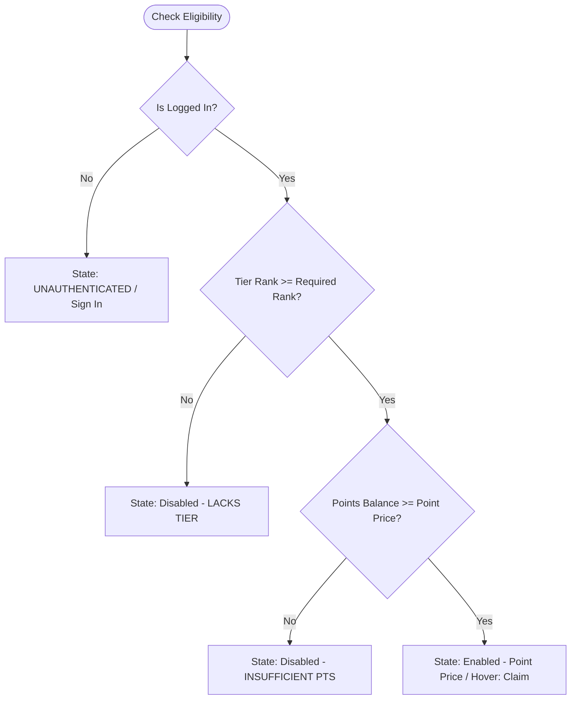

# Data Model: Promo Page Redesign

**Feature**: `007-promo-page-redesign` | **Date**: 2026-08-17

This document defines the entities, field structures, validation rules, state transitions, and tier hierarchies for the Promo Page.

---

## 1. Entity Definitions

### 1.1 `GlobalPromotion` (System-wide Active Marketing Campaigns)
Represents global seasonal or system-wide promotions rendered in the top banner/carousel.

| Field | Type | Required | Description |
| :--- | :--- | :---: | :--- |
| `id` | `string` | Yes | Unique identifier (e.g., `promo-global-1`) |
| `title` | `string` | Yes | Headline title (e.g., "Summer Splash: 20% Off All Washes") |
| `description` | `string` | Yes | Summary of the promotional deal |
| `discountPercentage` | `number` | No | Numeric discount (e.g., 20) |
| `badgeLabel` | `string` | No | Display badge (e.g., "Active Campaign", "Weekend Special") |
| `validUntil` | `string` | Yes | ISO date string or formatted date range |
| `isActive` | `boolean` | Yes | Whether the promotion is currently active |

---

### 1.2 `ClaimablePromo` (Tier-Categorized Reward Offers)
Represents catalog reward offers available for points redemption by tier.

| Field | Type | Required | Description |
| :--- | :--- | :---: | :--- |
| `id` | `string` | Yes | Unique identifier (e.g., `offer-nano-coating`) |
| `title` | `string` | Yes | Name of perk/reward (e.g., "Free Nano Coating") |
| `description` | `string` | Yes | Description of what is included |
| `pointPrice` | `number` | Yes | Points required to claim (e.g., `1000`) |
| `requiredTier` | `LoyaltyTierLevel` | Yes | Minimum tier required (`MEMBER` \| `SILVER` \| `GOLD` \| `PLATINUM`) |
| `tierGroup` | `string` | Yes | Display category (`SILVER TIER & ABOVE`, `GOLD TIER & ABOVE`, `PLATINUM TIER`) |
| `perkType` | `string` | Yes | Associated wash perk/add-on ID |
| `validityDays` | `number` | No | Days valid from claim date (default: 30 days) |

---

### 1.3 `ClaimedPromo` (User-Redeemed Active Vouchers)
Represents an active voucher held by the authenticated customer.

| Field | Type | Required | Description |
| :--- | :--- | :---: | :--- |
| `id` | `string` | Yes | Unique claimed voucher instance ID (e.g., `claim-8921`) |
| `promoId` | `string` | Yes | Reference to source `ClaimablePromo` ID |
| `title` | `string` | Yes | Name of claimed reward (e.g., "10% Off Standard") |
| `description` | `string` | No | Details of the voucher |
| `claimedAt` | `string` | Yes | ISO timestamp when claimed |
| `validUntil` | `string` | Yes | Expiration date (e.g., "Oct 30, 2026") |
| `status` | `ClaimedPromoStatus` | Yes | `ACTIVE` \| `USED` \| `EXPIRED` |
| `perkIdentifier` | `string` | Yes | Identifier passed into booking modal for auto-application |

---

### 1.4 `LoyaltyProfileContext`
Customer state retrieved from `DashboardResponse`.

| Field | Type | Required | Description |
| :--- | :--- | :---: | :--- |
| `customerId` | `string` | Yes | Customer ID |
| `phone` | `string` | Yes | Phone number identifier |
| `tier` | `LoyaltyTier` | Yes | Current tier details (`id`, `name`, `perks`) |
| `pointsBalance` | `number` | Yes | Current spendable points |
| `claimedPromos` | `ClaimedPromo[]` | Yes | List of user's active/past claimed promos |

---

## 2. Enums & Types

```typescript
export type LoyaltyTierLevel = "MEMBER" | "SILVER" | "GOLD" | "PLATINUM";

export const TIER_RANK: Record<string, number> = {
  member: 0,
  silver: 1,
  gold: 2,
  platinum: 3,
  MEMBER: 0,
  SILVER: 1,
  GOLD: 2,
  PLATINUM: 3,
};

export type ClaimedPromoStatus = "ACTIVE" | "USED" | "EXPIRED";

export type PromoButtonState =
  | { type: "CLAIMABLE"; pointPrice: number }
  | { type: "LACKS_TIER"; requiredTier: LoyaltyTierLevel }
  | { type: "INSUFFICIENT_PTS"; pointPrice: number; deficit: number }
  | { type: "UNAUTHENTICATED" };
```

---

## 3. Eligibility & State Transition Rules

### 3.1 Eligibility Evaluation Algorithm
Given `customer` (with `tier` and `pointsBalance`) and `promo` (with `requiredTier` and `pointPrice`):



### 3.2 Claim State Transition
1. **Trigger**: User clicks "Claim" on an eligible card.
2. **Pre-condition Validation**:
   - `pointsBalance >= promo.pointPrice`
   - `customerTierRank >= promoRequiredTierRank`
3. **Execution**:
   - Deduct points: `pointsBalance = pointsBalance - promo.pointPrice`.
   - Instantiate `ClaimedPromo` voucher with `validUntil = now + promo.validityDays`.
   - Append to `claimedPromos` in state and local storage / API.
4. **Post-condition**:
   - Dynamic button states on all cards re-evaluate with the updated `pointsBalance`.
   - Success confirmation toast/message displayed.
