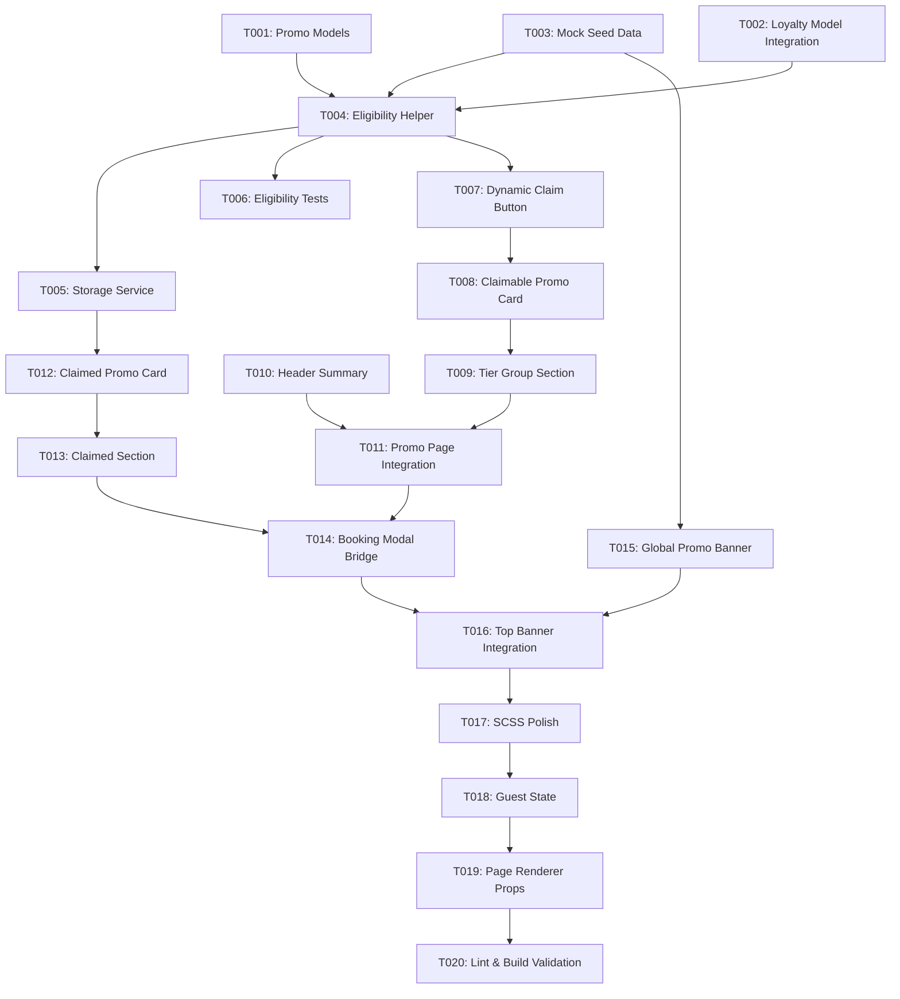

# Tasks: Promo Page Redesign

**Input**: Design documents from `specs/007-promo-page-redesign/` (`spec.md`, `plan.md`, `data-model.md`, `contracts/promo-page-contract.md`, `research.md`, `quickstart.md`)

**Prerequisites**: `plan.md`, `spec.md`, `data-model.md`, `contracts/promo-page-contract.md`

**Organization**: Tasks are structured by phase and grouped by user story (P1, P2, P3) to allow independent implementation and test verification.

## Format: `- [ ] [TaskID] [P?] [Story?] Description with file path`

- **[P]**: Parallelizable task (independent file or decoupled implementation)
- **[Story]**: User Story tag (`[US1]`, `[US2]`, `[US3]`) mapping to `spec.md`
- Explicit file paths are specified for every task

---

## Phase 1: Setup & Data Model Extension

**Purpose**: Establish data models, tier rank definitions, and initial catalog seed structures for the promo domain.

- [X] T001 Define `GlobalPromotion`, `ClaimablePromo`, `ClaimedPromo`, `LoyaltyTierLevel`, and `TIER_RANK` in `frontend/src/models/promo.model.ts`
- [X] T002 [P] Extend `frontend/src/models/loyalty.model.ts` to export promo-related types and claimed voucher interfaces
- [X] T003 [P] Add seed dataset for global promotions and tier-categorized claimable promos in `frontend/src/services/loyalty.mock-data.ts`

---

## Phase 2: Foundational Logic & Eligibility Helpers

**Purpose**: Core eligibility calculation and claim management logic required across the user stories.

- [X] T004 Implement pure eligibility evaluation helper `checkPromoEligibility` and button state resolver in `frontend/src/services/promo-eligibility.service.ts`
- [X] T005 [P] Implement local storage management utilities for claimed promos (`ezwash-claimed-promos`) in `frontend/src/services/promo-storage.service.ts`
- [X] T006 Add unit checks verifying eligibility transitions (eligible, lacks tier, insufficient points) in `frontend/src/services/promo-eligibility.service.test.ts`

**Checkpoint**: Foundation ready — all user story UI implementations can now proceed.

---

## Phase 3: User Story 1 - View and Claim Tier-Eligible Promotions (Priority: P1) 🎯 MVP

**Goal**: Deliver the tier-categorized claimable promo catalog (`Silver Tier & Above`, `Gold Tier & Above`, `Platinum Tier`) featuring dynamic point-price buttons that animate to "Claim" on hover, evaluate tier/point requirements, and instantly deduct points upon claim.

**Independent Test**: Sign in as a Gold member with 1,500 points, view cards across tier groups, verify hover state transforms from `{points} pts` to `Claim`, claim a 1,000 pt reward, verify balance immediately updates to 500 pts, and observe higher-cost cards transitioning to `INSUFFICIENT PTS`.

- [X] T007 [P] [US1] Create dynamic claim button component with CSS hover transition and disabled state styling in `frontend/src/components/promo-card/claim-button.component.tsx`
- [X] T008 [P] [US1] Create `ClaimablePromoCard` component displaying promo title, tier badge, point price, and dynamic action button in `frontend/src/components/promo-card/claimable-promo-card.component.tsx`
- [X] T009 [US1] Implement tier-grouped catalog layout (`TierGroupSection`) displaying tier headings (`Silver Tier & Above`, `Gold Tier & Above`, `Platinum Tier`) and grid layout in `frontend/src/pages/promo/components/tier-promo-section.component.tsx`
- [X] T010 [US1] Implement customer header summary displaying current tier and available points balance in `frontend/src/pages/promo/components/promo-header-summary.component.tsx`
- [X] T011 [US1] Integrate claim execution logic in `frontend/src/pages/promo/promo.page.tsx` ensuring balance decrements and updates without page reload

**Checkpoint**: User Story 1 (MVP) is fully functional and testable independently.

---

## Phase 4: User Story 2 - Manage and Redeem Claimed Promos in Booking (Priority: P2)

**Goal**: Provide a "Your Promos (Claimed)" section displaying active vouchers with expiration dates and a "USE NOW" call-to-action that launches the booking modal with the voucher applied.

**Independent Test**: View claimed promo vouchers under "Your Promos (Claimed)", click `[ USE NOW ]` on a voucher, and verify the reservation modal opens with the selected promo discount/perk pre-selected.

- [X] T012 [P] [US2] Create `ClaimedPromoCard` component displaying voucher name, validity date range, and "USE NOW" button in `frontend/src/components/promo-card/claimed-promo-card.component.tsx`
- [X] T013 [US2] Create "Your Promos (Claimed)" section container with active voucher grid and empty state in `frontend/src/pages/promo/components/claimed-promos-section.component.tsx`
- [X] T014 [US2] Wire "USE NOW" action handler in `frontend/src/pages/promo/promo.page.tsx` and `frontend/src/App.tsx` to trigger `handleOpenBookings` with promo perk context

**Checkpoint**: User Stories 1 and 2 deliver an end-to-end claim and booking redemption loop.

---

## Phase 5: User Story 3 - Discover Global Active Promotions (Priority: P3)

**Goal**: Showcase system-wide marketing campaigns and seasonal announcements in a dedicated top banner/carousel area.

**Independent Test**: Load the Promo page and verify global active promotions (e.g., "Summer Splash: 20% Off All Washes", "Free Tire Shine Weekend") render in the top horizontal banner/carousel with navigation controls.

- [X] T015 [P] [US3] Create top global promotions banner component with horizontal scroll/carousel in `frontend/src/pages/promo/components/global-promo-banner.component.tsx`
- [X] T016 [US3] Integrate global promotions banner at the top of `frontend/src/pages/promo/promo.page.tsx` with fallback data from `homepage.mock-data.ts`

**Checkpoint**: All three wireframe sections (Global Promos, Claimed Promos, Acclaimable Promos) are assembled.

---

## Phase 6: Polish & Cross-Cutting Integration

**Purpose**: Responsive styling, guest/unauthenticated states, accessibility, and build validation.

- [X] T017 Update SCSS styles in `frontend/src/pages/promo/promo.page.scss` to match wireframe design, responsive layout (320px to 1440px), and hover animations
- [X] T018 [P] Handle guest/unauthenticated state in `frontend/src/pages/promo/promo.page.tsx` with "Sign In to Claim" prompts
- [X] T019 Update `frontend/src/components/page-renderer/page-renderer.component.tsx` to supply dashboard and booking callback props to `PromoPage`
- [X] T020 Validate full frontend build via `npm run lint` and `npm run build` from `frontend/`

---

## Dependencies & Execution Order

---

## Parallel Execution Opportunities

- **Phase 1 & 2**: `T002`, `T003`, `T005` can be developed in parallel alongside `T001`.
- **Phase 3 (US1)**: `T007` (button component) and `T008` (card layout) can be created in parallel.
- **Phase 4 & 5 (US2 & US3)**: `T012` (claimed card) and `T015` (global banner) can be built in parallel.
- **Phase 6**: `T018` (guest state) and `T017` (SCSS styling) can be completed concurrently before `T020`.

---

## Implementation Strategy & MVP

1. **MVP Scope**: Complete Phase 1 through Phase 3 (User Story 1: T001–T011). This gives a functional promo catalog where users can review tier eligibility, observe hover animations, and claim rewards with real-time balance deductions.
2. **Incremental Delivery**:
   - Deliver US2 (T012–T014) to enable claimed voucher viewing and launching the booking modal.
   - Deliver US3 (T015–T016) to surface top-level system marketing campaigns.
   - Deliver Polish (T017–T020) for responsive styling and final build verification.
